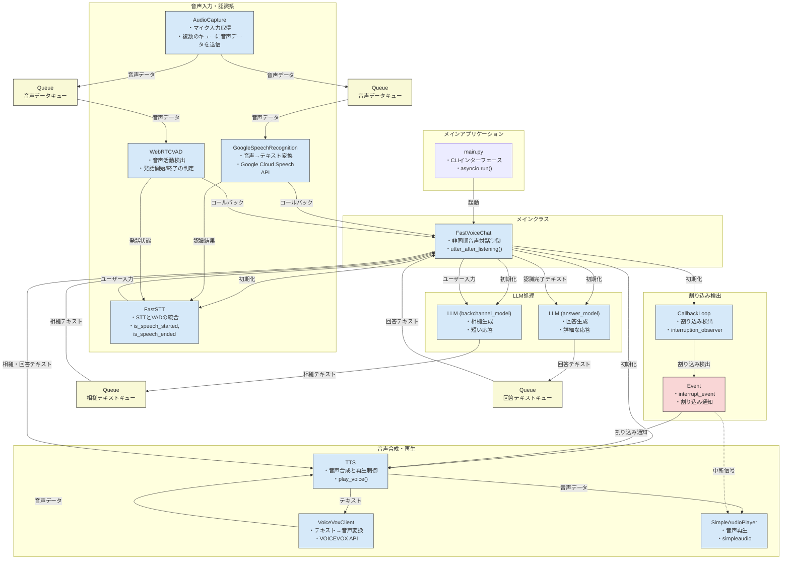

# fastvoicechat  
逐次応答生成の考え方に基づく高速な音声対話を実行するデモプログラムです。
回答生成にopenai api、音声認識にgoogle stt、音声合成にvoicevoxを使用します。

対話システムにおける逐次応答生成とは、ユーザの発話途中から、逐次的に回答を生成する方式のことです。ユーザの発話が完了してから回答を生成する方式に比べ、発話交代の待機時間を短くできます。
具体的な実装例として、[remdis](https://github.com/remdis/remdis)などがありますが、モジュールサーバーを多く起動する必要があり、軽く試すには手間が多いです。

そこで、ほとんどのモジュールをクラスとして一つのスクリプトから呼び出すことで、より手軽に試しやすくすることを意図したのが、本リポジトリの実装です。簡単に試しやすい分、メンテナンス性や安定性には劣るため、デモ用途と割り切って活用いただけると幸いです。


# 使い方
## 環境
以下で動作確認済み。windowsやubuntu、M1以外のmacでは正しく動作しない可能性があります。特にthreadやaudio関係の処理がOS依存性が強そうです。

- M1 MacbookAir 
- python 3.11

## 準備

- voicevoxを起動する

```sh
git clone [url]
# 必要ならpipの前に仮想環境作成
cd fastvoicechat
# 環境変数ファイルをコピーして、voicevox、openai api、google stt用のjsonの情報を記入
cp .env_sample .env
```

## 起動

```sh
uv run main.py [--disable_interrupt] [--use-async]
```

PCに話しかけて返答が再生されれば成功。

## プログラムから使う

基本的には非同期処理で扱うことをおすすめします。
`autter_after_listening`によって、ユーザの発話に対し高速に音声応答することができます。

```Python
import asyncio
from fastvoicechat import FastVoiceChat

async def amain():
    fastvoicechat = FastVoiceChat(allow_interrupt=False)
    print("喋って!")
    await fastvoicechat.autter_after_listening()
    print("終了")
    await fastvoicechat.astop()

if __name__ == "__main__":
    asyncio.run(amain())
```

同期処理の中で使う場合は、`utter_after_listening`を使ってください。
`utter_after_listening`はイベントループを内部で生成するため、非同期関数の内側で実行するとエラーになりますので、注意してください。

```Python
from fastvoicechat import FastVoiceChat

def main():
    fastvoicechat = FastVoiceChat(allow_interrupt=False)
    print("喋って!")
    fastvoicechat.utter_after_listening()
    print("終了")
    fastvoicechat.stop()

if __name__ == "__main__":
    asyncio.run(main())
```

# システム解説

## システム構成図



## 主要コンポーネントの構成

### 1. 中核制御クラス
- **FastVoiceChat**: 全体の制御を担い、各コンポーネント間の連携とデータフローを管理します。

### 2. 音声入力・認識系
- **AudioCapture**: マイクから音声データを取得し、STTとVADの両方のキューに送信します。
- **FastSTT**: 音声認識と音声活動検出を統合した高レベルクラス。以下の2つのコンポーネントを管理します：
  - **GoogleSpeechRecognition**: Google Cloud Speech APIを使用して音声をテキストに変換します。
  - **WebRTCVAD**: WebRTCVADによりユーザの発話状態を検出します。

### 3. LLM処理系
- **LLM (backchannel_model)**: ユーザ発話中の認識結果に対して、相槌（「うん」「なるほど」など）を生成します。
- **LLM (answer_model)**: ユーザ発話完了後の認識結果に対して、完全な回答を生成します。

### 4. 音声合成・再生系
- **TTS**: テキストを音声に変換し、再生を制御します。
- **VoiceVoxClient**: VOICEVOX APIを使用してテキストから自然な音声を生成します。
- **SimpleAudioPlayer**: 生成された音声を再生するコンポーネントです。

### 5. 割り込み制御系
- **CallbackLoop (interruption_observer)**: ユーザーが話し始めたときにシステムの発話を中断するための監視を行います。
- **Event (interrupt_event)**: 割り込みが発生したことを通知するイベントです。

## データフロー

1. **音声入力フロー**:
   - マイクからの音声データが`AudioCapture`によって取得され、STTとVADの両方のキューに送られます。
   - `GoogleSpeechRecognition`がキューから音声データを取得し、テキストに変換します。
   - `WebRTCVAD`が音声活動を検出し、ユーザーの発話状態を追跡します。

2. **対話処理フロー**:
   - ユーザーが話し始めると、`LLM (backchannel_model)`が入力テキストから適切な相槌を生成します。
   - ユーザーの発話が終了すると、`FastVoiceChat`の`utter_after_listening()`メソッドが相槌を再生した後、`LLM (answer_model)`に完全な回答の生成を依頼します。

3. **音声出力フロー**:
   - 生成されたテキスト（相槌または回答）が`TTS`に送られます。
   - `VoiceVoxClient`がテキストを音声データに変換します。
   - `SimpleAudioPlayer`が音声データを再生します。

4. **割り込み処理**:
   - ユーザーが再び話し始めると、`interruption_observer`が検出し、`interrupt_event`をセットします。
   - `interrupt_event`がセットされると、現在再生中の音声が中断され、新しい対話サイクルが始まります。


